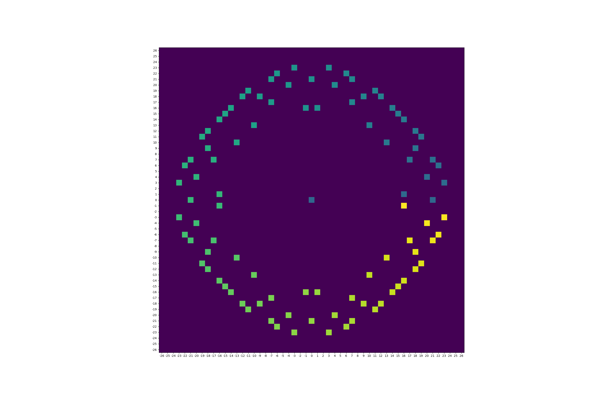

EXE download with "packs" file:  
https://cdn.discordapp.com/attachments/831143726873182208/1203834304661168209/pfcg.zip?ex=65d28910

Place the "packs" folder in C:\Users\{NAME}\AppData\Roaming\.minecraft\saves\{WORLD}\datapacks  
If you want to add more functions then add them to the most nested file.  
Use /function to activate.  
  
  
Inpuit:  

input num_beams: 96  
input min_radius: 16  
input max_radius: 26  

Output:  

  

angle between beams in degrees: 3.75  
average angle error in degrees: 0.1308 3.49%  
max angle error in degrees: 0.3151 8.4%  
+ One .mcfunction file
