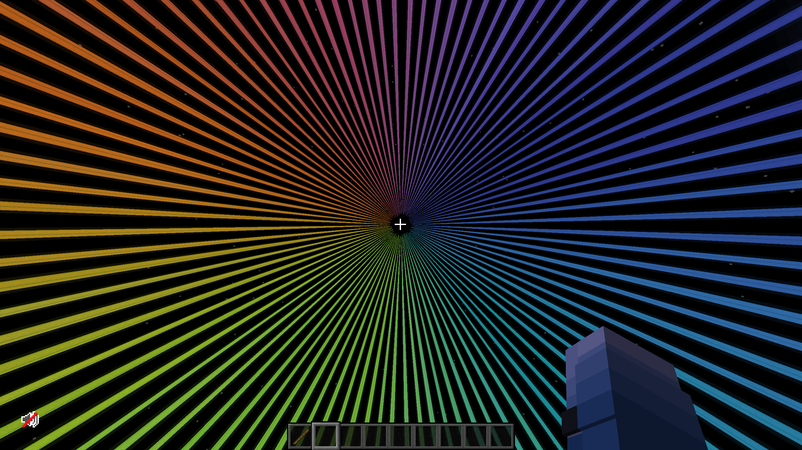

Files are saved in your schematic folder, if it exists. Else, it will be saved in the current directory.
If the program closes w/o output, then you need bigger radius (there is a message for that but it closes too fast).

Example input:  

number of beams: 96\
min radius: 13\
max radius: 23\
number of colors: 3\
input colors in HEX (without #)\
nr. 1: FF0000\
nr. 2: 00FF00\
nr. 3: 0000FF\
processing...

Output:  

File saved: {dir}

Big thanks for creators of these videos for giving me the idea:
https://youtu.be/nJlZT5AE9zY
https://youtu.be/VcsEm7FnheU

Someone else who made something similar a bit earlier:
https://github.com/Evolved-Cow-Man/minecraft-beacon-util ****
